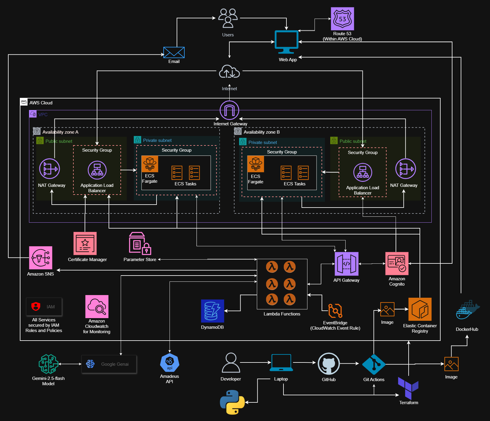

<a id="top"></a>
# Flight Search Web Application

A Python/Flask & AWS based flight search web application that allows users to search for the cheapest flight deals using the Amadeus API
& set trip alerts that will notify users when a flight is available at a set price. 

<!-- TABLE OF CONTENTS -->
<details>
  <summary>Table of Contents</summary>
<ul>
    <li><a href="#project-notes">Project Notes</a></li>
    <li><a href="#features">[Features](#features)</a></li>
    <li><a href="#aws-architecture">AWS Architecture</a></li>
    <li><a href="#how-it-works---production-scenario">How it Works (Production Scenario)</a></li>
    <li><a href="#requirements">Requirements</a></li>
    <li><a href="#installation---local-execution">Installation - Local Execution</a></li>
    <li><a href="#installation---docker-execution">Installation - Docker Execution</a></li>
    <li><a href="#troubleshooting">Troubleshooting</a></li>
    <li><a href="#disclaimer">Disclaimer</a></li>
  </ul>
</details>

## Project Notes
This project demonstrates:
* Designing a cloud-native, multi-AZ architecture on AWS, combining containerized web workloads with serverless and event-driven components
* Secure user authentication and authorization using Amazon Cognito with JWT-based OAuth flows
* HTTPS traffic termination and authentication offloading at the Application Load Balancer using AWS Certificate Manager and Amazon Cognito
* Backend API protection and request validation via Amazon API Gateway with JWT authorizers
* Containerized web application deployment using Amazon ECS Fargate in private subnets behind an Application Load Balancer
* Immutable container image management with Amazon ECR, enabling safe and repeatable deployments
* Serverless backend processing using AWS Lambda for API handling and background workloads
* Scheduled and event-driven processing implemented with Amazon EventBridge and Lambda
* Cost-efficient data storage and querying using Amazon DynamoDB with optimized access patterns
* Secure secret and configuration management using AWS Systems Manager Parameter Store
* All compute resources in private subnets access external services securely through NAT Gateways without exposing inbound internet access.
* All AWS services and resources operate using least-privilege IAM roles and policies following security best practices.
* Scalability and reliability measures, including multi-AZ deployments, API Gateway throttling, and Lambda concurrency controls
* CI/CD automation using GitHub Actions for container image builds, Docker & ECR registry publishing, and infrastructure deployment ***(see GitHub folder workflow files)***
* Infrastructure as Code (IaC) using Terraform for centralized, repeatable provisioning and lifecycle management ***(see Terraform folder READme file)***
* Observability and operational monitoring using Amazon CloudWatch for logs, metrics, and alarms
* AI-assisted user experience powered by Google Gemini Genai and integrated with lambda and API Gateway

This repository reflects a production-style separation of concerns, with clear divisioning of frontend, authentication, backend APIs, and asynchronous processing.

<p align="right"><a href="#top">⬆ Back to top</a></p>

## Features

- Search for flights by destination and origin cities.
- Set a trip alert that notifies users when flights are available.
- Specify flight details i.e. number of passengers, travel class, travel dates etc.
- View flight results with pricing and details.
- Chatbot assistance for city names with IATA codes to fit API parameters or for travel information.
- Site news communication through email.
- Communication with Amadeus Flight Offers API.
- Built with Flask, Bootstrap 5, Jinja2 templates, Flask-WTF, WTForms, Flask sessions, CSRF protection.
- Integrated with AWS as Backend.

## AWS Architecture



## How It Works - Production Scenario
1) The web application is developed locally, containerized with Docker, and deployed to AWS using Amazon ECS Fargate. ***(Local & Docker deployments are available for demonstration purposes. Production deployment is down due to personal cost moderation but can be implemented and would need a few moments to set up).***
2) End users access the application via a custom domain managed in Amazon Route 53, which routes traffic to an Application Load Balancer (ALB) over HTTPS.
3) The Application Load Balancer terminates TLS using certificates managed by AWS Certificate Manager and forwards traffic to ECS Fargate tasks running in private subnets.
4) Users must sign up and log in to access protected functionality within the application.
5) User authentication and authorization are handled by Amazon Cognito, which issues signed JWTs after successful login.
6) Authentication is offloaded to the Application Load Balancer and Amazon Cognito, reducing authentication logic inside the containerized application.
7) The Fargate hosted web application communicates with backend services through an Amazon API Gateway (HTTP API).
8) API Gateway validates incoming requests using a Cognito JWT authorizer, ensuring only authenticated users can access protected endpoints & data.
9) Backend APIs are implemented as multiple AWS Lambda functions, each with a clearly defined responsibility and isolated permissions.
10) A set of Lambdas handle the following operations:
    * The flight search Lambda queries the Amadeus API to retrieve available flight data.
    * A write Lambda stores trip alert data in Amazon DynamoDB
    * A read Lambda queries user alerts
    * A delete/update Lambda manages alert lifecycle changes
    * A subscriber Lambda registers user email addresses with an Amazon SNS topic, enabling email-based notifications and announcements.
    * A scheduled processor Lambda is triggered by an Amazon EventBridge cron rule to periodically scan DynamoDB for active alerts and evaluate flight price conditions.
    * The processor Lambda securely retrieves third-party API credentials and email configuration values from AWS Systems Manager Parameter Store.
    * A chatbot powered by a Lambda function that integrates with an AI foundation model (Gemini 2.5 Flash), providing AI-assisted responses.
11) When a flight matching a user’s price criteria is found, the processor Lambda sends a notification email to the user using SMTP.
12) Amazon CloudWatch is used to monitor ECS tasks, Lambda executions, API Gateway requests, and application logs for observability and operational insight.
13) Continuous Integration and Deployment of the application & infrastructure is implemented on the developers end with Automated Infrastructure deployment and management with Terraform & GitActions. 

<p align="right"><a href="#top">⬆ Back to top</a></p>

## Requirements

- Internet connection
- Python 3.12 or higher (For local execution)
- Docker Desktop (For Docker execution) 
- ***Or see Demo Readme file in demo folder***


## Installation - Local Execution

1. Clone the git repository:
    ```bash
    $ git clone <git-url>
    $ cd Flight-Search-Webapp
   ```

2. Install required packages:
    ```bash
    $ pip install -r requirements.txt
   ```

3. Execute the program and visit the IP Address shown on terminal:
    ```bash
    $ python main.py
    $ example: * Running on http://192.0.0.1:3002
   ```
<p align="right"><a href="#top">⬆ Back to top</a></p>

## Installation(Docker Execution)

1. Install Docker Desktop on your computer

2. Open the Docker app and make sure Docker is running
 
3. Run the program:
    ```bash
    $ docker run tomdocks7/flightsyte -p 5000:5000
   ```

## Troubleshooting

**Common Issues**
- Form Validation Errors:
  - Ensure all required fields are filled
  - Check dates and passenger counts 

- No Flight Results:
  - Verify city names are correct
  - Check that dates are in the future

- Unable to search flights:
  - Make certain you are logged in  

- API Server Errors, KeyError:
  - Make sure you have internet connection
  - Try again after 5-10 minutes

**"Module not found" error?**
- Run `pip install -r requirements.txt` first

**Python not found?**
- Download Python from [python.org](https://python.org)
- Make sure to check "Add Python to PATH" during installation
- Alternative commands:
  ```bash
  $ python -m pip install -r requirements.txt
  or
  $ python3 -m pip install -r requirements.txt
  or
  $ py -m pip install -r requirements.txt
    ```
    ```bash
    $ py main.py
    ```

**Still having issues, try these:**
- Check Python version: `python --version`
- Ensure you're in the project directory
- Copy the error and paste on Google or a Gen A.I. tool.
- Open an issue on GitHub with your error message

<p align="right"><a href="#top">⬆ Back to top</a></p>

## Disclaimer
***NB: Numerous improvements can be made to this application.*** 

***NB: This was constructed to merely display the developers capabilities in terms of software and cloud engineering knowledge and skills.***


